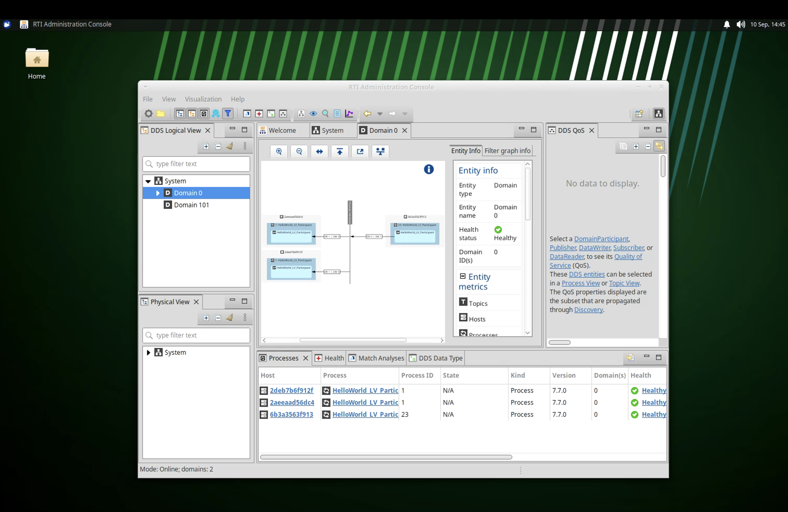

# HelloWorld Compose demo

This demo generates the C HelloWorld example in an SDK container, starts one
publisher and two independent subscribers in Runtime containers, and starts
Admin Console in an XRDP desktop. All services use the same Compose network.

## Prerequisites

Build the required local images first:

```sh
docker buildx bake --load sdk runtime-c ui-tools
```

Provide an RTI license:

1. Go to the [RTI Connext evaluation page](https://evaluation.rti.com/).
2. Sign in or create an RTI account, then request an evaluation license for
	RTI Connext.
3. Download the `rti_license.dat` file and keep it outside this repository.
4. Set `RTI_LICENSE_FILE_HOST` to its absolute path:

```sh
export RTI_LICENSE_FILE_HOST=/absolute/path/rti_license.dat
```

The demo includes [ui-password.txt](ui-password.txt) with the RDP password
`rti`. The license is mounted read-only into the Runtime and UI containers. To
use a different password, set `UI_PASSWORD_FILE_HOST` to a readable single-line
password file.

## Start the demo

```sh
docker compose -f examples/hello_world/compose.yaml up -d
```

The `generate` service creates the generated C sources and executable in the
`hello-world-build` volume. `subscriber-one`, `subscriber-two`, and `publisher`
then use that volume. The publisher repeats so the endpoints remain visible in
Admin Console.

Connect an RDP client to `localhost:3389`, log in as `user` with password
`rti`, and select automatic discovery or Domain 0. Admin Console should show
the `HelloWorld` topic with one DataWriter and two DataReaders. The subscriber
container logs also show received `HelloWorld` samples:



```sh
docker compose -f examples/hello_world/compose.yaml logs -f subscriber-one subscriber-two
```

`UI_RDP_PORT` changes the loopback RDP port. `DOCKER_PLATFORM` selects the SDK
and Runtime architecture. Admin Console remains amd64-only.

## Stop and clean up

```sh
docker compose -f examples/hello_world/compose.yaml down --volumes
```

Removing volumes deletes the generated example and Admin Console preferences.
